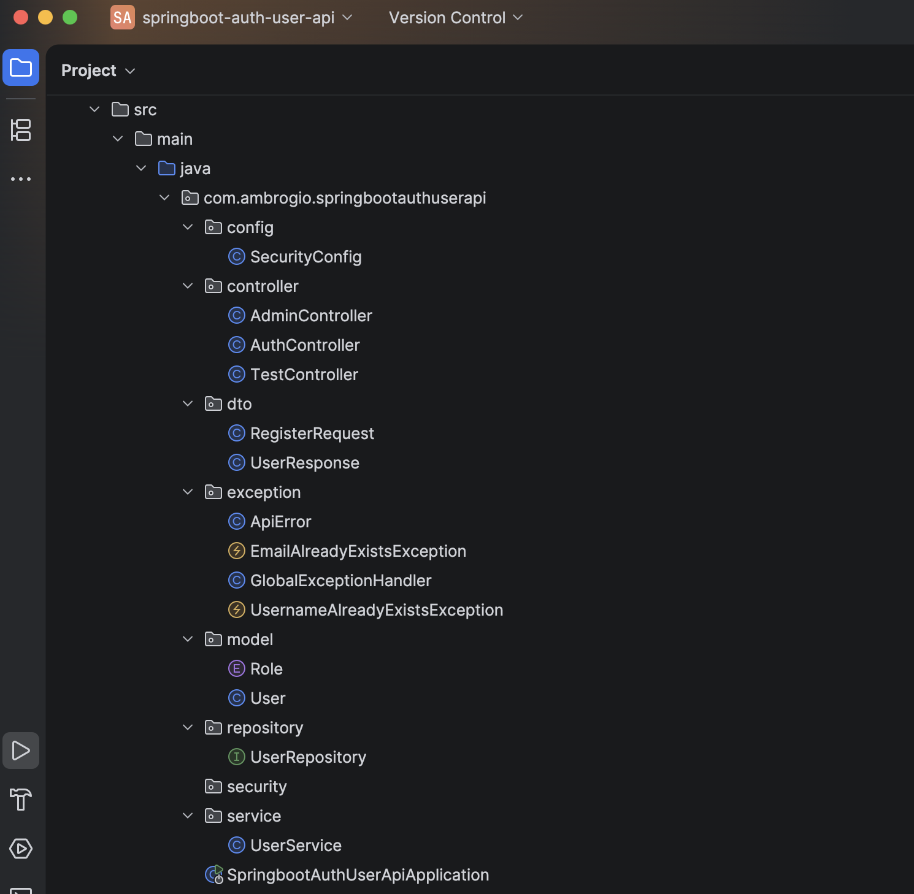
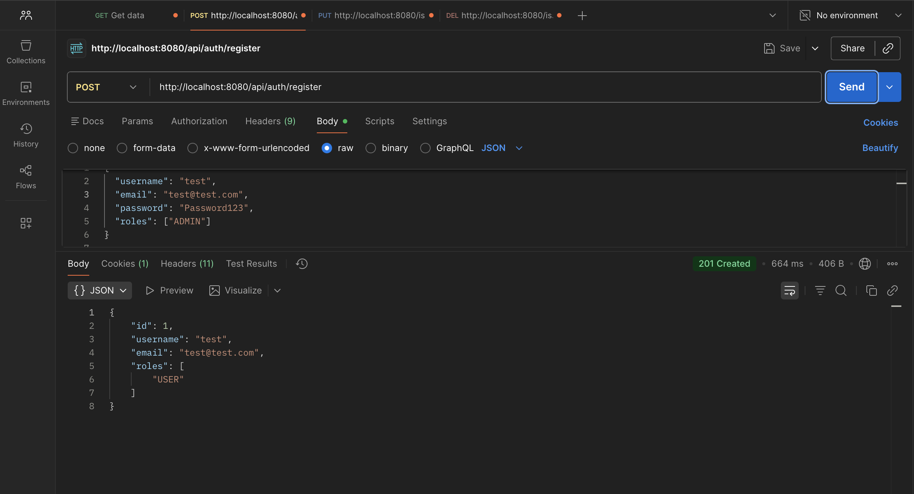
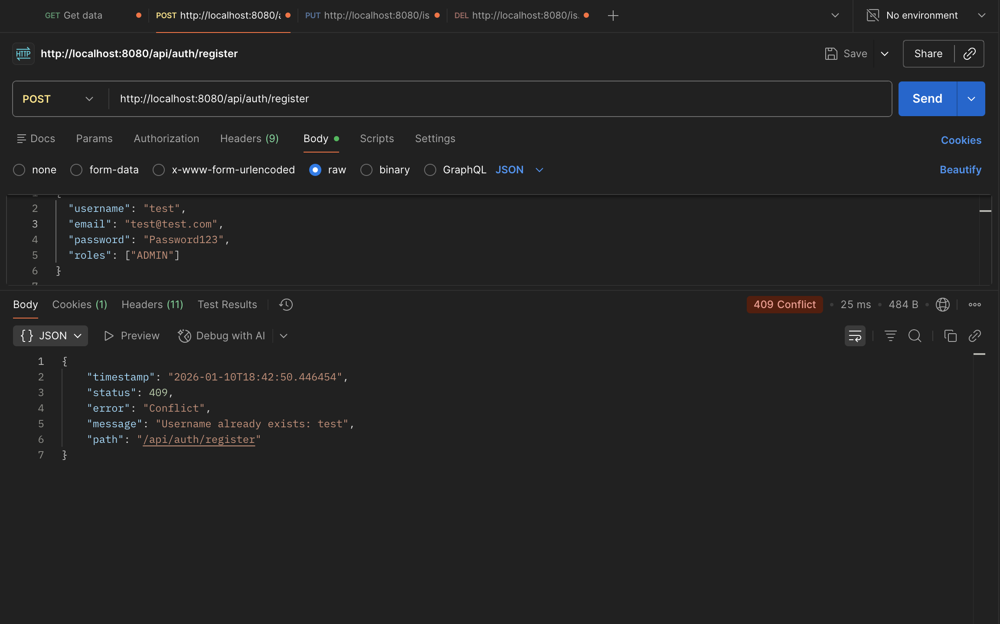
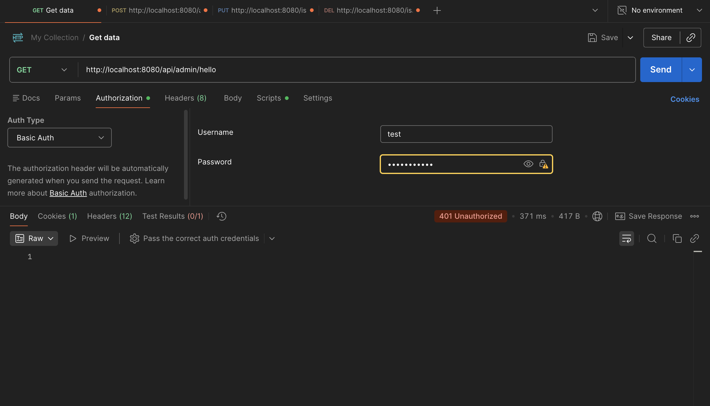
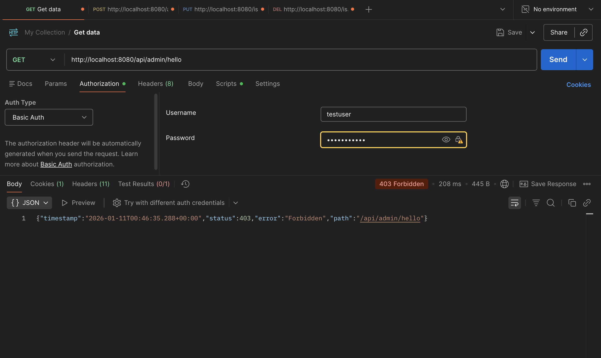
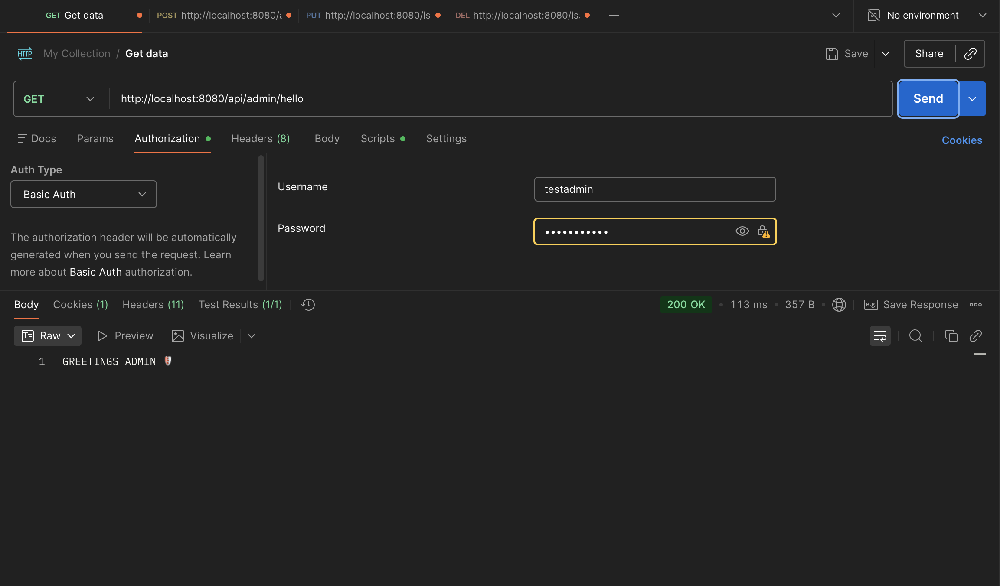

# 🔐 Spring Boot Auth User API

A secure, real-world style **authentication + user registration REST API** built with **Spring Boot** and **Spring Security**.

This project demonstrates:
- clean controller/service/repository layering
- DTO request + response
- BCrypt password hashing
- default role assignment
- role-based authorization
- global exception handling with correct HTTP codes

---

## 🛠 Tech Stack
- Java
- Spring Boot
- Spring Security
- Spring Data JPA
- H2 Database
- Jakarta Validation
- Maven
- Postman

---

## 📂 Project Structure


---

## ✅ Register Success (201 Created)


---

## ❌ Register Conflict (409 Conflict)


---

## 🔒 Unauthorized Access (401 Unauthorized)


---

## 🚫 USER Forbidden from Admin (403 Forbidden)


---

## ✅ ADMIN Allowed (200 OK)


---

## 📌 Endpoints

### Public
- `POST /api/auth/register` (register new user)

### Protected (examples)
- Admin-only route(s) (requires ADMIN role)

---

## ▶️ Run Locally

```bash
git clone https://github.com/AmbrogioBailey/<your-repo-name>.git
cd <your-repo-name>
./mvnw spring-boot:run
Server:

http://localhost:8080

👤 Author
Ambrogio Bailey

GitHub: https://github.com/AmbrogioBailey

LinkedIn: https://www.linkedin.com/in/ambrogio-bailey-b67529373/
